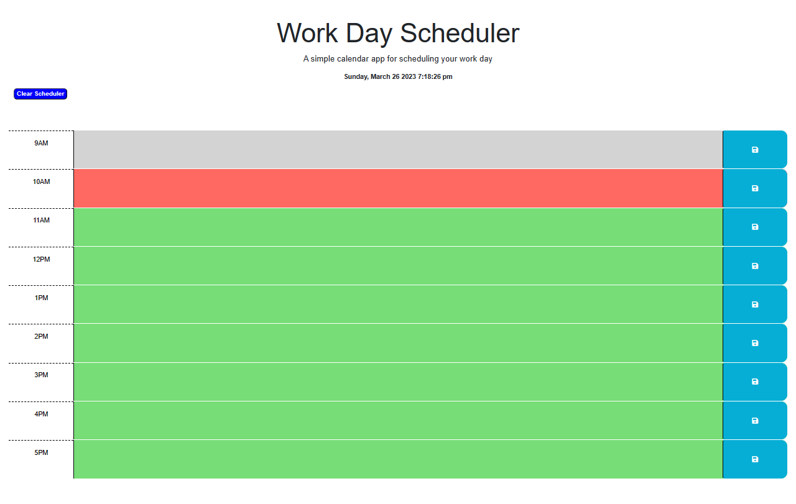

# Work Day Scheduler Third Party API

## Description

This application was created using HTML, JavaScript, jQuery, CSS and [Day.js](https://day.js.org/en/) library.

Workday scheduler application is created as front-end application with local storage. 
This application provides and very good tool for daily planning of activities, especially when the user has a busy schedule. Planned activities can be recorded by single saving button and the information remains until is fully cleared by the clear scheduler button.

Day time hours are changing color for visual management of the activities over a designated block of time.

Past sections are marked in grey color, actual hour activities are colored in red color and for future activities we used the green color.

This application I learned how to use an external API to obtain the date and time accurately, simplify the JavaScript coding using jQuery.

## Table of Contents (Optional)

- [Installation](#installation)
- [Usage](#usage)
- [Credits](#credits)
- [License](#license)

## Installation

The actual application does not require to install on local drive. This can be used directly from the browser. 
Links to Day.Js and jQuery are already included on the HTML section,; both will run by the browser.

Link to GitHub Depository:

https://github.com/MauricioGB1/MAUGB-M5C-Work-Day-Scheduler-Third-Party-API

Link to the WEB deployed application and ready to run from the browser:

## Usage

Work Day Scheduler application is very user friendly and intuitive for the user.
Working Hours are presented on the left side from 9:00 am thru 5:00pm, each hour has a special
 section to log the activities corresponding to that section.
On the middle upper section, a current date and time is displayed so user know at any moment the actual time in accurate way.

The second section is designed for blocks which user can enter the daily activities according to each segment of time.
after each activity is entered a save button on the left side marked in blue color should be clicked so the data is recorded.
Even if the browser is reloaded the activities will remain there and saved in the local storage.

If the user needs to clear all the sections from the work day scheduler it is possible
 using the clear scheduler button located on the top left section in blue color.
 Once this blue button is activated the data recorded on each of the segments will be deleted from the input section
 and from the local storage. the browser is reloaded.

Main Overview Application

Input from user to log each of the activities and appointments thru each day

Location of button to save the activity for eaxch time segment

Special button that allows user to clear the activities from the work day scheduler and the local storage.

## Credits

Special Thank you to the RICE University Coding team.

Thank you to Traversy Media. Youtube: https://www.youtube.com/@TraversyMedia

## License

This application is running under the MIT license.

## Features

- jQuery usage of functions
- Use of APY Day.Js with accurate time and date data
- Local storage properties
- Interactive user log data for activities
- Active time and date updated every second

